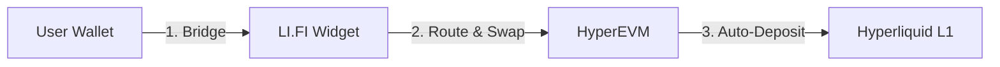

# HyperGate

<div align="center">
  
  <h1>HyperGate</h1>
  <p>
    <strong>One-click bridge + deposit to Hyperliquid trading accounts.</strong>
  </p>
  <p>
    <a href="https://hypergate-pi.vercel.app">Live Demo</a> •
    <a href="docs/INDEX.md">Documentation</a> •
    <a href="#features">Features</a>
  </p>
</div>

---

## ⚡️ Overview

**HyperGate** removes the friction from Hyperliquid onboarding. Instead of the traditional 3-step process (Swap → Bridge → Deposit), users can bridge from **any chain** and land funds directly in their **Hyperliquid L1 trading account** in a single transaction.

Built with **LI.FI** for optimal cross-chain routing and **React + Vite** for a highly responsive, premium user experience.

## ✨ Features

- **🚀 One-Click Onboarding**: Combines bridging and L1 deposit into a seamless flow.
- **🛣️ Any-to-Any Routing**: Bridge from Ethereum, Arbitrum, Optimism, Base, and more directly to USDC on Hyperliquid.
- **🛡️ Safety Guard 2.0**: Intelligent protections that block deposits below the protocol minimum ($5.10) with detailed fee breakdowns.
- **💎 Institutional UI**: Clean, white-label design with real-time progress indicators and dark mode aesthetics.
- **🎮 Demo Mode**: Full simulation capability for testing the UX without real funds (Toggle with `] ] ]`).

## 🛠️ Architecture

HyperGate orchestrates a complex flow behind a simple UI:



See [Architecture Docs](docs/architecture/01-overview.md) for deeper details.

## 🚀 Quick Start

### Installation

```bash
npm install
```

### Development

```bash
# Start all apps (Demo + SDK)
npm run dev

# Build for production
npm run build
```

## 📦 Project Structure

This monorepo is managed with [Turbo](https://turbo.build/):

- `apps/demo`: Vite + React presentation app.
- `packages/widget`: The core `@hypergate/widget` library usable in any dApp.
- `docs/`: Comprehensive technical documentation.

## 🤝 Contributing

Contributions are welcome! Please read our [Contribution Guide](docs/guides/03-development.md).

## 📄 License

## 📄 License

MIT

---

<div align="center">
  <p>
    Made with ❤️ by <strong>Robert Vassallo</strong>, <strong>Alex Pivovarov</strong>, and <strong>Keanu Czirjak</strong><br>
    for the <strong>Encode Hyperliquid Hackathon</strong>
  </p>
</div>
